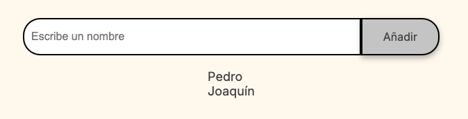

# Amigo Secreto

## Descripción: 

Esta app tiene por objetivo ayudar en el sorteo de un juego de amigo secreto. Se ingresan los participantes y luego se sortean los nombres.

## Uso

1. Ecribe el nombre de cada unos de los amigos que participarán en el sorteo, ingresalos uno por uno, luego presiona el botón Añadir. En la pantalla podrás ver como se van agregando los amigos a la lista del sorteo.

2. Cuando ya hayas ingresado todos los amigos participantes del sorteo. Presiona el botón Sortear Amigo.

3. Como resultado del sorteo obtendrás un nombre de la lista el cual es el amigo sorteado.

